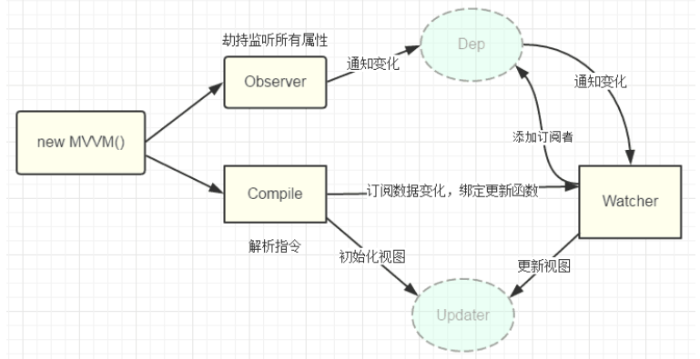

# Vue3 深度理解 (由浅及深)

写了那么久的 Vue3，理解一下 Vue3 的原理，从浅到深。

- Vue3 reactivity system:

## 双向数据绑定 (Two-way data binding)

Vue 是数据双向绑定的框架 (MVVM)，双向绑定由三个重要部分构成:

- 数据层（Model）：应用的数据及业务逻辑
- 视图层（View）：应用的展示效果，各类 UI 组件
- 业务逻辑层（ViewModel）：框架封装的核心，它负责将数据与视图关联起来

### ViewModel

```text
Model <---> ViewModel <---> View
```

- 数据 (Model) 变化后更新视图 (View)
- 视图 (View) 变化后更新数据 (Model)

它有两个主要部分组成:

1. 监听器（Observer）：对所有数据的属性进行监听
2. 解析器（Compiler）：对每个元素节点的指令进行扫描跟解析,根据指令模板替换数据,以及绑定相应的更新函数

### 实现双向绑定 (Two-way data binding)



Note:  
由于 `data` 的某个 `key` 在⼀个视图中可能出现多次 (使用了多次 `{{ name }}`)，所以每个 `key` 都需要⼀个管家 `Dep` 来管理多个 `Watcher`. 将来 data 中数据⼀旦发生变化，会首先找到对应的 `Dep`，通知所有 `Watcher` 执行更新函数.

### 依赖收集 (Dependency Collection)

视图中会用到 `data` 中某 `key`，这称为依赖。同⼀个 `key` 可能出现多次，每次都需要收集出来用⼀个 `Watcher` 来维护它们，此过程称为**依赖收集 (Dependency Collection)**. 多个相同 `Key` 的 `Watcher` 需要⼀个 `Dep` 来管理，需要更新时由 `Dep` 统⼀通知.


## 组件间的通信 (Communication between components)

### `v-bind` / `prop` 单向数据流 (One-Way Data Flow)

数据从父组件流到子组件, 而子组件不能改变父组件传来的数据. This prevents(v. 预防) child components from accidentally(adv. 意外地) mutating(n. 变化) the parent's state.

```ts
// Child.vue
import { ref, defineProps, withDefaults } from "vue"
interface Props {
  text: string
}

const props = withDefaults(defineProps<Props>(), {
  text: "Snack Bar Text"
})

// Parent.vue
<child v-bind:text="hello"></child>

```

### `v-model` 双向数据绑定 (2-way binding)

常用于表单数据绑定, 父组件通过 v-model 绑定一个 value. 子组件修改父组件传过来的 value 时通过 emit 一个 `update:moduleValue` 事件. 父组件接收这个事件后, 修改这个 value.

修改父组件 value 的, 是父组件本身, 子组件只负责发送一个事件给父组件, 父组件收到子组件的 `update` Event 后自行更改. 本质上不打破单向数据流原则. (The principle of **One-Way Data Flow**)

不用 ` v-model` 实现的 2-way binding:

```vue
// Child.vue
<script setup>
const props = defineProps(["modelValue"]);
const emit = defineEmits(["update:modelValue"]);
</script>
<template>
  <input
    :value="props.modelValue"
    @input="emit('update:modelValue', ($event.target as HTMLInputElement).value)"
  />
</template>

// Parent.vue
<Child :modelValue="foo" @update:modelValue="($event) => (foo = $event)" />
```

使用 `v-model` 和 `defineModel`, 子组件的 model 是一个 `Ref` 保持响应式 (Reactivity).

```vue
// child component: const model = defineModel
<string></string>
```

## 实现 EventEmitter 事件触发器

### Observer 观察者模式

观察者模式定义了对象间的 **一种一对多** 的依赖关系，当一个对象的状态发生改变时，所有依赖于它的对象都将得到通知，并自动更新.

观察者模式属于**行为型模式**，行为型模式关注的是 **对象之间的通讯**，观察者模式就是观察者和被观察者之间的通讯.

  
被观察者 be observed object:

```js
class Subject {
  constructor() {
    this.observerList = [];
  }

  addObserver(observer) {
    this.observerList.push(observer);
  }

  removeObserver(observer) {
    const index = this.observerList.findIndex((o) => o.name === observer.name);
    this.observerList.splice(index, 1);
  }

  // notify all observers. Call all the observers `notified()` function
  notifyObservers(message) {
    const observers = this.observeList;
    observers.forEach((observer) => observer.notified(message));
  }
}
```

观察者 observer:

```js
class Observer {
  constructor(name, subject) {
    this.name = name;
    if (subject) {
      subject.addObserver(this);
    }
  }

  notified(message) {
    console.log(this.name, "got message", message);
  }
}
```

used:

```js
const subject = new Subject();
const observerA = new Observer("observerA", subject);
const observerB = new Observer("observerB");
subject.addObserver(observerB);
subject.notifyObservers("Hello from subject");
subject.removeObserver(observerA);
subject.notifyObservers("Hello again");
```

### 发布订阅模式 (Publish-Subscribe)

发送者不会将信息直接发送给指定的订阅者, 而是将发布的信息 **分为不同的类型**, 发布者无需了解存在哪些订阅者. 订阅者会自己接收指定类型的信息.

同样的，订阅者可以表达对一个或多个类别的兴趣，只接收感兴趣的消息，无需了解哪些发布者存在.


发布者 (publisher) 和订阅者 (subscriber) 需要透过一个 broker(中间人, 也叫发布订阅中心) 进行关联, 但 **发布者的发布动作和订阅者的订阅动作相互独立, 无需关注对方.** 消息派发由发布订阅中心负责.

broker(发布订阅中心 PubSub):

```js
class PubSub {
  constructor() {
    // msg Map like this:
    // { "type": ["content", "c2", "c3"] }
    this.messages = {};
    // listeners Map like:
    // {"type": [Function, Funtion, Function]}
    this.listeners = {};
  }

  // add publish msg
  // pass msg type and content
  publish(type, content) {
    // check whether the msg exists
    const existContent = this.messages[type];
    if (!existContent) {
      // if the specified type msg does not exist, initialize to empty list []
      this.messages[type] = [];
    }
    // push content to the list
    this.messages[type].push(content);
  }

  // add subscriber
  // pass subscriber type and callback function
  subscribe(type, cb) {
    // check whether the subscriber exists
    const existListener = this.listeners[type];
    if (!existListener) {
      // if the specified type subscriber does not exist,
      // initialize to empty list []
      this.listeners[type] = [];
    }
    // push callback to list
    this.listeners[type].push(cb);
  }

  // notify specified type subscriber
  notify(type) {
    // get msgs
    const messages = this.messages[type];
    // get subscriber callbacks
    const subscribers = this.listeners[type] || [];
    subscribers.forEach((cb, index) => cb(messages[index]));
  }
}
```

Publisher 发布者:

```js
class Publisher {
  // content is broker (PubSub 发布订阅者中心)
  constructor(name, context) {
    this.name = name;
    this.context = context;
  }
  publish(type, content) {
    this.context.publish(type, content);
  }
}
```

Subscriber 订阅者:

```js
class Subscriber {
  // content is broker (PubSub 发布订阅者中心)
  constructor(name, context) {
    this.name = name;
    this.context = context;
  }
  subscribe(type, cb) {
    this.context.subscribe(type, cb);
  }
}
```

Use:

```js
import { Subscriber, PubSub, Publisher } from "./EventMitter.js";

const TYPE_A = "A";
const TYPE_B = "B";
const TYPE_C = "C";

const pubsub = new PubSub();

const print = () => {
  console.log(`msgs: ${JSON.stringify(pubsub.messages)}`);
  console.log(`subs: ${JSON.stringify(pubsub.listeners)}`);
  console.log("----------------------------------------");
};

// pubA
const publisherA = new Publisher("publisherA", pubsub);
publisherA.publish(TYPE_A, "we are young");
publisherA.publish(TYPE_A, "we are young 2");
publisherA.publish(TYPE_B, "the silicon valley");

// pubB
const publisherB = new Publisher("publisherB", pubsub);
publisherB.publish(TYPE_A, "stronger");

print();

// subA
const subscriberA = new Subscriber("subscriberA", pubsub);
subscriberA.subscribe(TYPE_A, (res) => {
  console.log("subscriberA received", res);
});

subscriberA.subscribe(TYPE_A, (res) => {
  console.log("subscriberA received", res);
});

subscriberA.subscribe(TYPE_C, (res) => {
  console.log("subscriberA received", res);
});

print();

pubsub.notify(TYPE_A);
pubsub.notify(TYPE_B);
pubsub.notify(TYPE_C);
```

### 实现 Simple EventEmitter

EventEmitter 本质上就是只有一个 publisher 的 PUB/SUB 模型

`Node` 采用了事件驱动机制，而 `EventEmitter` 就是 `Node` 实现事件驱动的基础.

在 `EventEmitter` 的基础上，`Node` 几乎所有的模块都继承了这个类，这些模块拥有了自己的事件，可以绑定／触发监听器，实现了异步操作

```js
class EventEmitter {
  constructor() {
    this.events = {};
  }

  // register event
  on(type, handler) {
    if (!this.events[type]) {
      this.events[type] = [];
    }
    this.events[type].push(handler);
  }

  addListener(type, handler) {
    this.on(type, handler);
  }

  prependListener(type, handler) {
    if (!this.events[type]) {
      this.events[type] = [];
    }
    this.events[type].unshift(handler);
  }

  removeListener(type, handler) {
    if (!this.events[type]) {
      return;
    }
    this.events[type] = this.events[type].filter((item) => item !== handler);
  }

  off(type, handler) {
    this.removeListener(type, handler);
  }

  // trigger event
  emit(type, ...args) {
    // run multiple handle
    this.events[type].forEach((item) => {
      Reflect.apply(item, this, args);
    });
  }

  // only excute one time, and then it will be deleted.
  once(type, handler) {
    this.on(type, this._onceWrap(type, handler, this));
  }

  _onceWrap(type, handler, target) {
    // closure can keep state
    // fired: Has this function ever been executed?
    const state = { fired: false, handler, type, target };
    // bind state context to function
    const wrapFn = this._onceWrapper.bind(state);
    state.wrapFn = wrapFn;
    return wrapFn;
  }

  _onceWrapper(...args) {
    if (!this.fired) {
      this.fired = true;
      Reflect.apply(this.handler, this.target, args);
      this.target.off(this.type, this.wrapFn);
    }
  }
}
```

used:

```js
class MyEmitter extends EventEmitter {}
const myEmitter = new MyEmitter();

function callback() {
  console.log("触发了event事件！");
}
myEmitter.on("event", callback);
myEmitter.emit("event");
myEmitter.removeListener("event", callback);
```

## Reference

1. [Three ways to expose internal Vue components API - Abdelrahman's Blog](https://logaretm.com/blog/three-ways-to-expose-vue-component-api/)
2. [Making the most out of Vue.js Injections - Abdelrahman's Blog](https://logaretm.com/blog/making-the-most-out-of-vuejs-injections/#use-typescript)
3. [node-deep/event/深入学习 Node.js EventEmitter.md at master · semlinker/node-deep · GitHub](https://github.com/semlinker/node-deep/blob/master/event/%E6%B7%B1%E5%85%A5%E5%AD%A6%E4%B9%A0%20Node.js%20EventEmitter.md)
